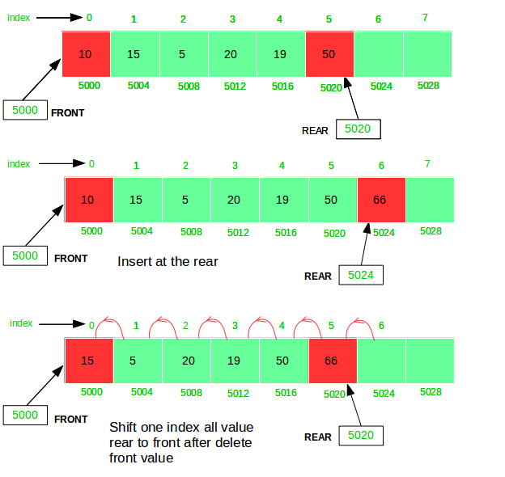

# Queue-DataStructure
To implement a <b>*Queue*</b> using array, create an array arr of size n and take two variables *front* and *rear* both of which will be initialized to 0 which means the queue is currently empty. Element rear is the index upto which the elements are stored in the array and front is the index of the first element of the array.

Now, some of the *implementation of queue operations* are as follows:

<b>*Enqueue:*</b> Addition of an element to the queue. Adding an element will be performed after checking whether the queue is full or not. If rear &lt; n which indicates that the array is not full then store the element at arr[rear] and increment rear by 1 but if rear == n then it is said to be an Overflow condition as the array is full.   

<b>*Dequeue:*</b> Removal of an element from the queue. An element can only be deleted when there is at least an element to delete i.e. rear > 0. Now, element at arr[front] can be deleted but all the remaining elements have to shifted to the left by one position in order for the dequeue operation to delete the second element from the left on another dequeue operation.

<b>*Front:*</b> Get the front element from the queue i.e. arr[front] if queue is not empty.

<b>*Display:*</b> Print all element of the queue. If the queue is non-empty, traverse and print all the elements from index front to rear.

<centre>  </centre>
